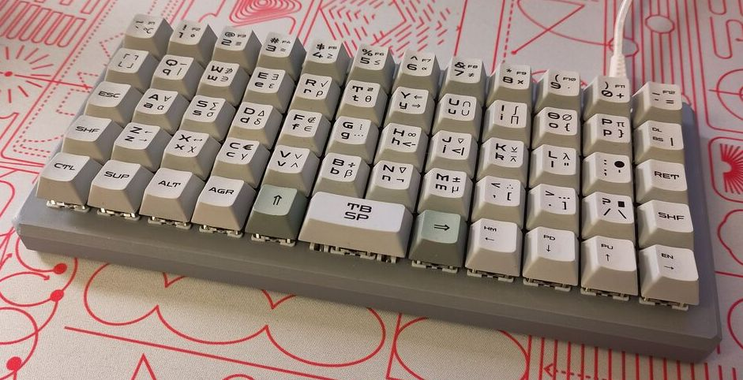

A⋅TE Portable Computers and Keyboards
========================================================

A⋅TE⋅B1
----------------------------------------------------

The [A⋅TE⋅B1](b1/) is an 3d-printed ortholinear keyboard with a
statisticians/programmers layout. The files are released under a [CC BY-SA
license](https://creativecommons.org/licenses/by-sa/4.0/).

