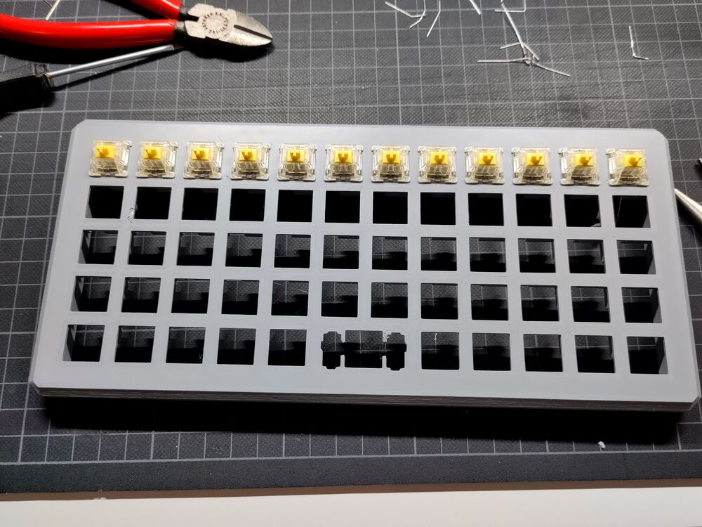

A⋅TE⋅B1 ortholinear keyboard
=====================================================

The [A⋅TE⋅B1](b1/) is an 3d-printed ortholinear keyboard with a
programmers/statisticians layout. The files are released under a [CC BY-SA
license](https://creativecommons.org/licenses/by-sa/4.0/).


Instructions
---------------------------------------------------------

Parts needed:

- 3d prints of the case and bottom
- Pro Micro controller. This build used a [Sparkfun Qwiic Pro Micro USB
  C](https://www.sparkfun.com/products/15795)
- 59 MX Switches and 2 stabilisers. This build used Gateron Keychron G Pro
  Yellow switches.
- 59 keycaps of which one 2 width keycap. In the build above existing keycaps
  were painted and labelled.
- 59 1N4148 diodes.
- 4 M2 screw inserts and 4 M2x8mm screws.

Tools needed:

- A soldering iron
- Wire stripper
- Some electric wire. For the columns solid core wire was used. To connect the
  rows and columns tot the controller stranded wire was used.


### Printing

The 3D print files are in the `stl/` directory. Both can be printed without
supports. The case should be printed upside down. The bottom bottom side down.
Supports are not needed. After printing two vertical supports in the slot that
holds the controller need to be removed (these are needed to be able to print
without supports). This can be done using an exacto knife and some prying. The
files are designed to fit a Prusa MK3s. 

Below are some photos of the case:




### Soldering

For general instructions see [A Complete Guide to Building a Hand-Wired Keyboard
by Ben
Chapman](https://www.crackedthecode.co/a-complete-guide-to-building-a-hand-wired-keyboard/) and
[the QMK guide on hand-wiring](https://docs.qmk.fm/#/hand_wire).  Below are
specific instructions for reproducing the build above and a picture of the
result:


- For the rows the legs of the diodes were bent around each other and soldered
  together.
- Note that the spacebar is connected to column 6 (starting from 0). 
- For the columns an insulated wire was used where the insulation was removed at
  the points where it needed to be soldered to the switches. The easiest way to
  do this is to cut the insulation using a wire stripper and then push the
  insulation down the wire.

*TODO: wiring scheme for the controller*

### Programming the controller

First, follow [the instructions](https://docs.qmk.fm/#/newbs_getting_started) to
set up QMK. The git repository contains the keyboard configuration for the
A⋅TE⋅B1 under `sofware/`. Copy the contents of this directory to the
`keyboards/` directory under QMK or make a symbolic link (under linux).

Note the code assumes that the controller is wired as above and that the same
controller is used. If that is not the case the configuration has to be modified
to reflect the differences.

You should now be able to do:
```
qmk compile -kb ate_b1 -km default
```

Should this work you can do
```
qmk flash -kb ate_b1 -km default
```
to flash the controller. Follow the onscreen instructions. To get the controller
into flash mode you will have to press the reset button one the controller twice
in quick succession.

And then the keyboard should work. 

### Key caps

For the key caps of this build existing key caps were used. The were given a
thorough sanding with 280 grit sand paper. The two coats of gray primer (Vallejo
airbrush primer) and two coats of silver gray (Vallejo) using a air brush. The
labels were printed on 12µm transparent water slide decal paper (svg file is in
the repo). Some tips for this: use rounded corners and use a small stiff flat
brush to smoothen the decal on the key cap. After that the keys were varnished
using 4 layers of satin varnish (Vallejo).


